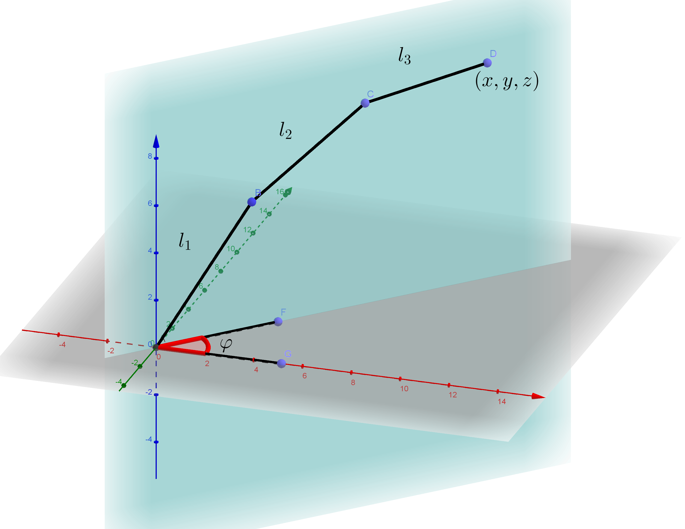
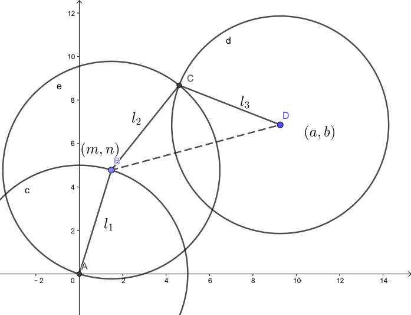

# Mechanism

To reach point D in space, the robotic arm first needs to rotate  degrees so that the linkages of the arm and the target point are coplanar (i.e. they all line on the blue plane). 

The spatial coordinate of the target point D is mapped to a coordinate on the blue plane, which could be calculated as follow

Consequently, this problem is simplied to a two dimensional route planning problem. 

As shown in the diagram above, the solution for this problem is not unique. A particular position of the first segment (l1) corresponds to a particular solution. However, not all positions of point B are suitable. We require:

&space;BD&space;\\&space;\\&space;&\sqrt{l_2^2&space;&plus;&space;l_3^2}&space;<&space;BD&space;\end{array}&space;\right." title="\large \large \left\{ \begin{array}{ll} &l_2 + l_3 > BD \\ \\ &\sqrt{l_2^2 + l_3^2} < BD \end{array} \right." />

The first condition ensures that point B won't be so far away from D that the arm couldn't reach D. The second condition ensures that B won't be so close to point D that the angle BCD becomes acute (because the servo cannot rotate more than 90 degrees to the right).

B is on a circle whose center is the origin and radius is l1, so its coordinates can be expressed as follow:

So the inequality could be formulated:

Any m that satisfies this inequality will be a solution. Given a particular m, the angles of servos could be calculated through a series of geometric derivations.

## Start interlude

Well, there is another more straightforward way to calculate the angle and the coordinates.

Suppose the angle subtended by the x-axis and DO is &phi; and the distance DO equals k. We can write the above formula into such:

At this point, naturally one will think of using the arcsin to solve the inequality. However, we have to make sure that the left side of the inequality is no smaller than -1, and the right side of the inequality is no larger than 1. Besides, as:

we have to make sure the angles are in the correct intervals.

Let's suppose the above inequality is in the interval [-1, 1]. Then
 
 

Let
 
 

 
 
We also need to check whether 180 - &delta;1 and 180 - &delta;2 is also an interval for &theta;1 + &phi;. To make sure that everything is proper, we need to check where 90 + &phi; lies inside the interval. 90 + &phi; is a limit that cannot be exceeded. Nevertheless, using this way we can find the range of &theta;1, and from then on we can easily find other angles.

## End interlude

 

&alpha; could be obtained by using the cosine rule

where c is the length of BD

&beta; can be found by applying arctan to the gradient of BD:

angle BCD can be found by using the cosine rule:

Finally, combine all equations and using only known values:

The spatial coordinate of each joint could be recovered from &phi;, &theta;1, &theta;2 and &theta;3:

