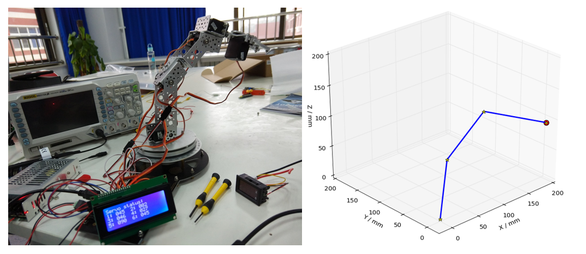

# Robotic Arm Simulator and Controller

Let the arm find its way to a given spatial coordinates

Remember to adjust the length of each link when instantiating the Arm object

Used together with the [Arduino-side program](https://github.com/hanzhi713/Robotic-Arm-Protocol) to control a physical robotic arm with six degrees of freedom

## Dependencies

Numpy, Matplotlib and PySerial

## How to use

Just execute the `simulator.py`

```bash
python3 simulator.py
```

## Mechanism

See [here](/Mechanism.md)

## Credits

@TianziFC for helping to derive the formulae

@Silverwings-zero for the initial arm assembly

@Vol0324 Alex for proposing another solution




